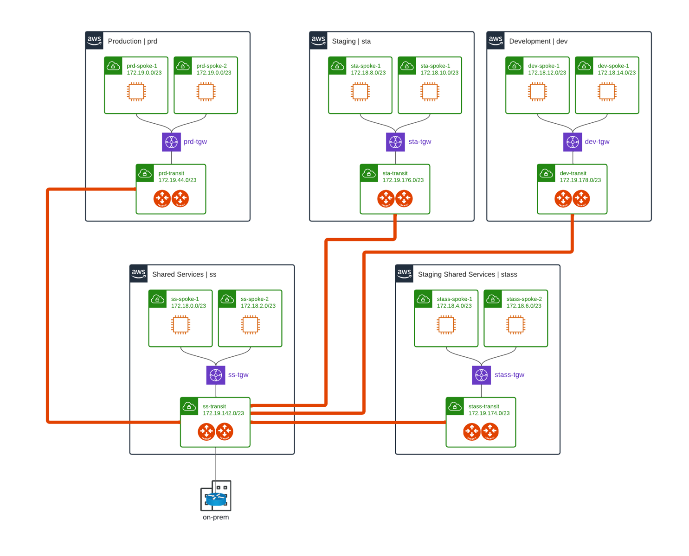
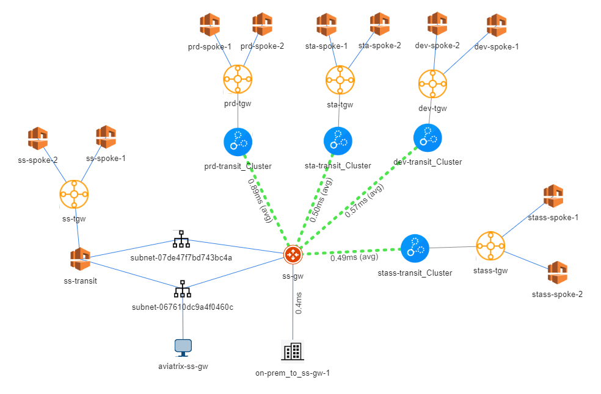

# Aviatrix Multi-TGW Orchestrator with Aviatrix Transit Gateway Peering

The code provided is for demo purposes only.





## Prerequisites

Please make sure you have:
- Aviatrix Controller 6.4
- AWS access accounts are onboarded. 


## Environment Variables

To run this project, you will need to set the following environment variables

Variables | Description
--- | ---
AVIATRIX_CONTROLLER_IP | Aviatrix Controller IP or FQDN 
AVIATRIX_USERNAME | Aviatrix Controller Username
AVIATRIX_PASSWORD | Aviatrix Controller Password
TF_VAR_aws_account | AWS Aviatrix Account 

## Run Locally

Clone the project

```bash
git clone https://github.com/bayupw/avx-aws-tgo-ss
```

Go to the project directory

```bash
cd avx-aws-tgo-ss
```

Set environment variables

```bash
export AVIATRIX_CONTROLLER_IP="aviatrixcontroller.aviatrix.lab"
export AVIATRIX_USERNAME="admin"
export AVIATRIX_PASSWORD="aviatrix123"
export TF_VAR_aws_account="AWS-Aviatrix-Account"
```

Terraform workflow

```bash
terraform init
terraform plan
terraform apply -auto-approve
```
## Inputs

| Name | Description | Default | Required |
|------|-------------|---------|----------|
| aws_account | AWS Account for Aviatrix Controller | `null` | yes |
| aws_region | AWS Region | `ap-southeast-2` | no |
| aws_instance_size | AWS gateway instance size | `t2.micro` | no |
| key_name | Existing SSH public key name | `null` | no |